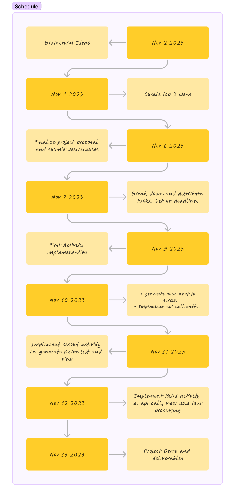

<!-- (This is a comment) INSTRUCTIONS: Go through this page and fill out any **bolded** entries with their correct values.-->

# AND101 Milestone 2 - **Team 13/PrepPilot**

Submitted by:
- **Team Member 1 Alfonso Vieyra**
- **Team Member 2 Siyuan Zhai**
- **Team Member 3 Tyler Thiem**
- **Team Member 4 Mina Yoon**
- **Team Member 5 Donovan Chen**

Time spent: **10** hours spent in total

## Summary

This document provides a summary of our project building process for our app, **PrepPilot**

## Milestone Requirements

<!-- Please be sure to change the [ ] to [x] for any features you completed.  If a feature is not checked [x], you might miss the points for that item! -->

The following REQUIRED features are completed:

- [X] Added front page layout and front end template for first activity screen- Tyler Thiem 
- [X] First activity screen, generated ingredients onto screen upon user input - Mina Yoon 
- [X] Processed recipe items and generated the image, their corresponding title and provided ID capture 
for recipe api call. Implemented recycler view and adapter for users to scroll screen vertically- Siyuan Zhai 
- [X] Implemented API calls for recipe list based off ingredients and recipe information based off user selection. 
Implemented response parsing, screen transitions and generated recipe and ingredient data upon user selecting a recipe.

Image created via **[Figma](https://www.figma.com/)**

The following REQUIRED files are included:

- [ ] Updated 📄 `project_spec.md`, which contains:
  - [X] App Overview (Milestone 1)
  - [X] App Spec (Milestone 1)
  - [X] Checked off 2+ completed features
  - [ ] 2+ Videos/GIFs of build progress

- [ ] Our 🎥 Demo Video
  - [ ] We have also added the Demo Video Link to the Group Info Form on the course portal.

The following EXTRA features are implemented:

- [X] Added a nested scroll for users to scroll ingredients and instructions in one page.

## 🎥 Demo Video

Here's a video that demos all of the app's implemented features:

VIDEO created with **[ScreenToGIF](https://www.screentogif.com/)**

## Notes

Here's a place for any other notes on this milestone!