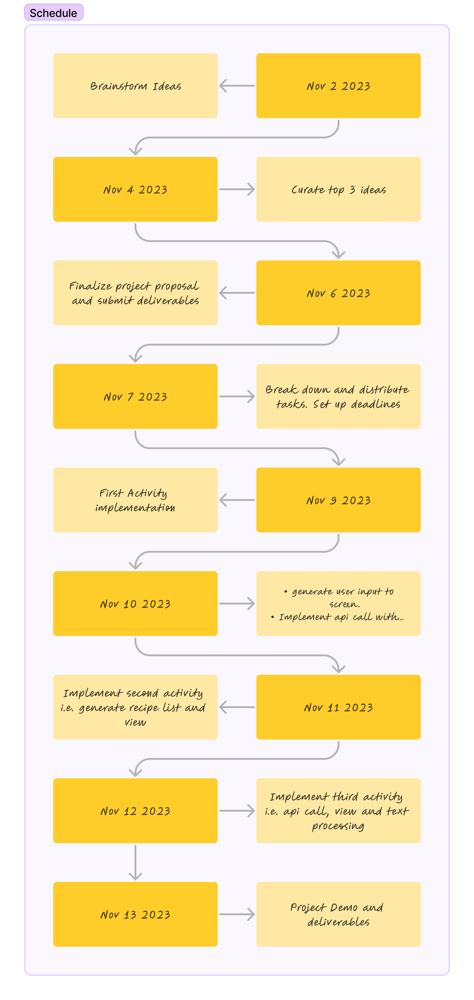

# **PrepPilot**

## Table of Contents

1. [App Overview](#App-Overview)
2. [Product Spec](#Product-Spec)
3. [Wireframes](#Wireframes)
4. [Build Notes](#Build-Notes)

## App Overview

### Description 

**PrepPilot is a mobile application that allows users to enter in a set of ingredients of their choosing. 
The application then takes in their choices and provides a list of delicious recipes that incorporate the ingredients
the user wanted.**

### App Evaluation

<!-- Evaluation of your app across the following attributes -->

- **Category:** Food recommendation app
- **Mobile:** app is read only and allows users to scroll through recipe ideas
- **Story:** Allows users to come up with newly discovered recipes that utilize the ingredients they desire
- **Market:** Target Market are food enthusiasts who want to develop new ideas to make their own delicious meals.
- **Habit:** We want users to develop the habit of making their own meals be it breakfast, lunch or dinner.
- **Scope:** Our app is catered to all adults of all backgrounds. 

## Product Spec

### 1. User Features (Required and Optional)

Required Features:

- Users can type in any ingredient they want
- Upon submission, users will have a list of recipe ideas 
- Users can select any recipe of their choice
- The recipe's themselves will have all the instructions to make the meal

Stretch Features:

- Users can select a category of food
- Information displays additional nutritional information

### 2. Chosen API(s)

- Spoonacular API:
  - Recipes 
  - Nutritional Information

### 3. User Interaction

Required Feature

- **User Types in ingredients (or selects from a list)**
  - => **Ingredients will be displayed upon each ingredient submission**

- **User will choose between a list of recipes containing their desired ingredients**
  - => **A list of recipes or food items**

- **User will click on any of the options on the list**
  - => **Will display recipe steps and additionaly nutritional info**

## Wireframes

<!-- Add picture of your hand sketched wireframes in this section -->

### [BONUS] Digital Wireframes & Mockups

### [BONUS] Interactive Prototype

## Build Notes

Here's a place for any other notes on the app, it's creation 
process, or what you learned this unit!  

For Milestone 2, include **2+ Videos/GIFs** of the build process here!

## License

Copyright **2023** **Alfonso Vieyra, Tyler Thiem, Siyuan Zhai, Donovan Chen, Mina Yoon**

Licensed under the Apache License, Version 2.0 (the "License");
you may not use this file except in compliance with the License.
You may obtain a copy of the License at

    http://www.apache.org/licenses/LICENSE-2.0

Unless required by applicable law or agreed to in writing, software
distributed under the License is distributed on an "AS IS" BASIS,
WITHOUT WARRANTIES OR CONDITIONS OF ANY KIND, either express or implied.
See the License for the specific language governing permissions and
limitations under the License.
